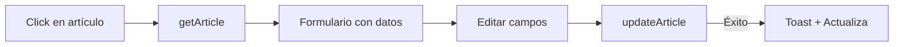

# 📰 Módulo de Blog / Contenido

Este módulo gestiona la creación, edición, publicación y archivo de artículos y noticias para el Hub Hospitalario.

---

## 📋 Índice

1. [Descripción General](#descripción-general)
2. [Estructura de Archivos](#estructura-de-archivos)
3. [Rutas y Páginas](#rutas-y-páginas)
4. [Componentes](#componentes)
5. [Server Actions](#server-actions)
6. [Modelo de Datos](#modelo-de-datos)
7. [Flujos de Usuario](#flujos-de-usuario)
8. [Dependencias](#dependencias)
9. [Notas de Desarrollo](#notas-de-desarrollo)

---

## 📖 Descripción General

El módulo de Blog permite a los usuarios autorizados:

- ✅ **Crear** nuevos artículos con editor de texto enriquecido
- ✅ **Editar** artículos existentes
- ✅ **Publicar** artículos para hacerlos visibles
- ✅ **Archivar** artículos publicados
- ✅ **Eliminar** artículos
- ✅ **Gestionar etiquetas** (crear y asignar)
- ✅ **Previsualizar** artículos antes de publicar
- ✅ **Filtrar y buscar** artículos por estado, sección y texto

---

## 📁 Estructura de Archivos

```
src/
├── app/
│   ├── modules/
│   │   └── content/                    # Carpeta del módulo
│   │       ├── page.tsx                # Lista de artículos
│   │       ├── new/
│   │       │   └── page.tsx            # Crear nuevo artículo
│   │       ├── [id]/
│   │       │   └── page.tsx            # Editar artículo existente
│   │       └── README.md               # Esta documentación
│   │
│   └── actions/
│       └── blog/
│           ├── articles.ts             # Acciones CRUD de artículos
│           └── metadata.ts             # Acciones para etiquetas/secciones
│
├── components/
│   └── modules/
│       ├── ArticlesTable.tsx           # Tabla/Grid de artículos
│       ├── ArticlePreview.tsx          # Modal de previsualización
│       ├── RichTextEditor.tsx          # Editor TipTap
│       └── TagSelector.tsx             # Selector de etiquetas
│
└── lib/
    └── pocketbase.ts                   # Cliente de PocketBase
```

---

## 🛤️ Rutas y Páginas

| Ruta | Archivo | Descripción |
|------|---------|-------------|
| `/modules/content` | `page.tsx` | Lista principal de artículos con filtros |
| `/modules/content/new` | `new/page.tsx` | Formulario para crear artículo |
| `/modules/content/[id]` | `[id]/page.tsx` | Formulario para editar artículo |

---

## 🧩 Componentes

### `ArticlesTable.tsx`

Componente principal que muestra la lista de artículos.

**Características:**
- Vista de **Grid** (tarjetas) y **Lista** (tabla)
- Filtros por estado y sección
- Búsqueda por texto
- Acciones rápidas (editar, publicar, archivar, eliminar)
- Confirmación modal para acciones destructivas

**Props:** Ninguna (carga datos internamente)

---

### `ArticlePreview.tsx`

Modal de previsualización de artículos.

**Props:**
```tsx
interface ArticlePreviewProps {
  article: {
    id: string;
    title: string;
    summary?: string;
    content: string;
    cover_image?: string;
    status: string;
    sections: string[];
    tags: string[];
    published_date: string;
    author?: string;
    collectionId?: string;
  } | null;
  isOpen: boolean;
  onClose: () => void;
}
```

---

### `RichTextEditor.tsx`

Editor de texto enriquecido basado en TipTap.

**Características:**
- Formato: Bold, Italic, Underline, Strike
- Encabezados: H1, H2, H3
- Listas: Ordenadas y no ordenadas
- Links y citas
- Modo oscuro compatible

**Props:**
```tsx
interface RichTextEditorProps {
  content: string;
  onChange: (content: string) => void;
}
```

---

### `TagSelector.tsx`

Selector múltiple de etiquetas con opción de crear nuevas.

**Props:**
```tsx
interface TagSelectorProps {
  selectedTags: string[];           // IDs de etiquetas seleccionadas
  onTagsChange: (tags: string[]) => void;
}
```

---

## ⚡ Server Actions

### `articles.ts`

| Función | Descripción | Parámetros |
|---------|-------------|------------|
| `getArticles(filters?)` | Obtiene lista de artículos | `{ status?, section?, search? }` |
| `getArticle(id)` | Obtiene un artículo por ID | `id: string` |
| `createArticle(data)` | Crea nuevo artículo | `FormData` |
| `updateArticle(id, data)` | Actualiza artículo | `id: string, FormData` |
| `deleteArticle(id)` | Elimina artículo | `id: string` |
| `publishArticle(id)` | Publica artículo | `id: string` |
| `archiveArticle(id)` | Archiva artículo | `id: string` |

### `metadata.ts`

| Función | Descripción | Parámetros |
|---------|-------------|------------|
| `getTags()` | Obtiene todas las etiquetas | — |
| `createTag(name)` | Crea nueva etiqueta | `name: string` |
| `getSections()` | Obtiene todas las secciones | — |

---

## 📊 Modelo de Datos

### Colección: `blog` (PocketBase)

| Campo | Tipo | Descripción |
|-------|------|-------------|
| `id` | string | ID único (auto) |
| `title` | string | Título del artículo |
| `summary` | string | Resumen corto |
| `content` | string | Contenido HTML |
| `cover_image` | file | Imagen de portada |
| `status` | select | `borrador`, `en_revision`, `publicado`, `archivado` |
| `sections` | relation[] | Secciones del hospital |
| `tags` | relation[] | Etiquetas |
| `published_date` | date | Fecha de publicación |
| `author` | relation | Usuario autor |
| `created` | date | Fecha de creación (auto) |
| `updated` | date | Última modificación (auto) |

### Colección: `etiquetas`

| Campo | Tipo | Descripción |
|-------|------|-------------|
| `id` | string | ID único |
| `Etiquetas` | string | Nombre de la etiqueta |

### Colección: `secciones`

| Campo | Tipo | Descripción |
|-------|------|-------------|
| `id` | string | ID único |
| `Seccion` | string | Nombre de la sección |

---

## 🔄 Flujos de Usuario

### Crear Artículo

```mermaid
graph LR
    A[Click "Nuevo Artículo"] --> B[Formulario vacío]
    B --> C[Llenar campos]
    C --> D{Acción}
    D -->|Guardar| E[createArticle]
    E -->|Éxito| F[Redirige a lista]
    D -->|Previsualizar| G[Modal preview]
```

### Editar Artículo



### Publicar Artículo

```mermaid
graph LR
    A[Click "Publicar"] --> B[Modal confirmación]
    B -->|Confirmar| C[publishArticle]
    C --> D[Cambia estado a "publicado"]
    D --> E[Actualiza lista]
```

---

## 📦 Dependencias

### Producción

| Paquete | Uso |
|---------|-----|
| `@tiptap/react` | Editor de texto enriquecido |
| `@tiptap/starter-kit` | Extensiones básicas |
| `@tiptap/extension-link` | Soporte para links |
| `@tiptap/extension-underline` | Formato subrayado |
| `date-fns` | Formateo de fechas |
| `lucide-react` | Iconos |
| `sonner` | Notificaciones toast |

### Componentes UI (shadcn/ui)

- `Button`, `Input`, `Card`
- `Select`, `Badge`, `Table`
- `Dialog`, `Tabs`

---

## 📝 Notas de Desarrollo

### Modo Oscuro

Todos los componentes de este módulo están optimizados para modo oscuro. Consulta `/docs/DESIGN_SYSTEM.md` para las convenciones de estilos.

### Validación

- El título es obligatorio
- Al menos una sección debe seleccionarse
- Las etiquetas son opcionales pero recomendadas
- La imagen de portada es opcional

### Manejo de Errores

Los errores se muestran mediante toasts usando `sonner`. Las acciones destructivas requieren confirmación mediante modal.

### Permisos

El módulo respeta los permisos del workspace actual. Solo usuarios con rol `admin` o `editor` pueden crear/editar artículos.

---

## 🚀 TODO / Mejoras Futuras

- [ ] Programar publicación (scheduled publishing)
- [ ] Historial de versiones
- [ ] Colaboración en tiempo real
- [ ] Comentarios internos
- [ ] SEO metadata personalizado
- [ ] Integración con redes sociales
- [ ] Estadísticas de lectura

---

*Última actualización: Diciembre 2024*
